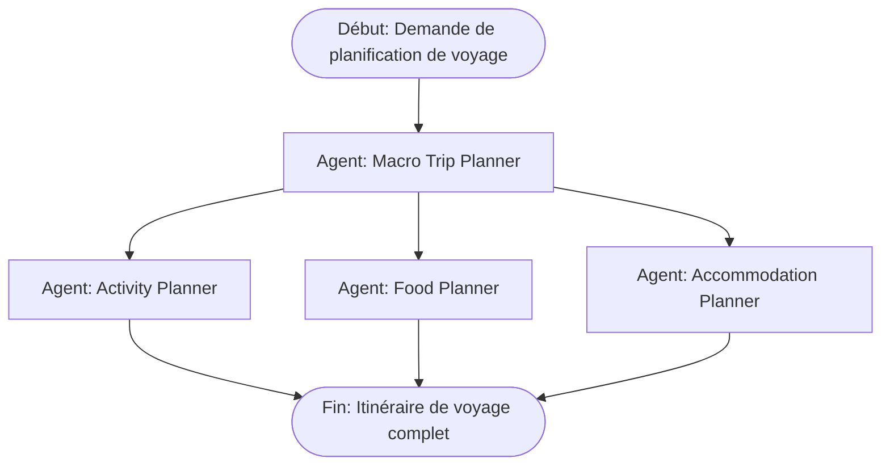
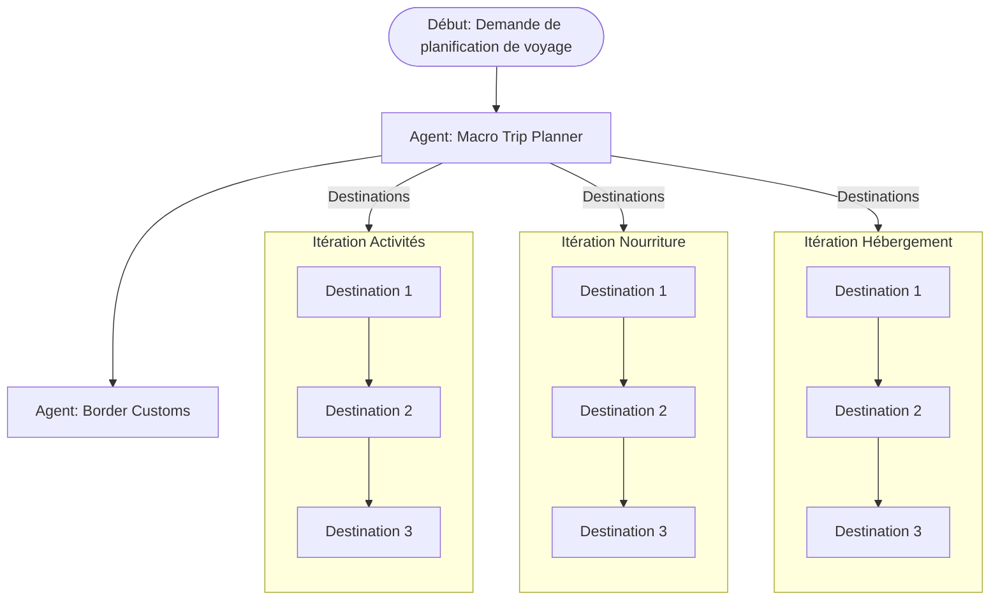

  <div class="mb-4 absolute bottom-4 left-12 text-align-left">
    <span class="text-6xl text-primary-lighter text-opacity-80" style="font-weight:500;" >
      Travel AI <light-icon icon="plane"/>
    </span>
    <div class="text-6xl text-white text-opacity-60" style="font-weight:600;" >
      Road to Vietnam
    </div> 
  </div>

---

# Le Vietnam

<div class="flex justify-center">
  
</div>

<!--
En 2026 je prévois de partir au Vietnam en vacances.
-->

---

# Le Vietnam - les paysages

<div class="flex justify-center">
  
</div>

<!--
Avec ses paysages magnifiques.
-->

---

# Le Vietnam - la bouffe

<div class="flex justify-center">
  
</div>

<!--
La street food incroyable qui n'a rien a envié à certaines cuisines occidentales
-->

---

# Le Vietnam - la culture

<div class="flex justify-center">
  
</div>

<!--
La culture riche et variée
-->

---

# Le Vietnam - ...la bouffe

<div class="flex justify-center">
  
</div>

<!--
La... street food...
-->

---

# Le Vietnam - ...???

<div class="flex justify-center">
  
</div>

<!--
Bon en fait je veux voyager mais j'y connais rien.

Je veux éviter de prendre un tour operator mais d'un autre côté je ne veux pas me retrouver à l'autre bout du monde sans rien savoir.
-->

---

# Preparer ses vacances

### Mes options :

<div v-click>

- Passer des heures sur internet à trouver les meilleurs plans

</div>
<div v-click>

- Demander à un ami qui a déjà été sur place

</div>
<div v-click>

- Demander à un agent de voyage

</div>
<div v-click>

- Déléguer à <span v-mark.red="5">une ou plusieurs</span> IA

</div>
<!--
Je pourrais passer des heures sur internet mais je ne suis pas sur d'explorer toutes les possibilités.

Je connais personne qui soit déjà aller au Vietnam, et même si c'était le cas, il n'aurait pas forcément les même attente que moi vis a vis de ce voyage.

Je pourrais demander à un agent de voyage, mais j'ai pas envi de voyager en groupe de 40.

Ma dernières option serait de déléguer à une équipe dédiée qui pourraient me faire un plan sur mesure, ou au moins une ébauche.
-->

---

# Mes premiers tests

...Ce nouveau reflexe

<div class="flex justify-center">
  
</div>
<a href="https://chatgpt.com/?q=Je veux voyager au Vietnam en 2026 pour environ 3 semaines. Aide moi a construire un plan de voyage." target="_blank" class="absolute bottom--10 right-0">
  Le poto
</a>
<!--
Le premier reflexe d'un gars dans l'ère du temps (quoi qu'un peu has been) c'est de demandé au poto GPT.

Je veux voyager au Vietnam en 2026 pour environ 3 semaines. Aide moi a construire un plan de voyage.

Il va faire quelques recherche et me sortir un plan de voyage sommaire des 3 semaines prévu.

C'est un bon point de départ mais à aucun moment il ne m'a demandé mes préferences, ma flexibilité, ma condition physique, mes envies, mes besoins....

Il a juste fait le boulot de me sortir un plan de tour operator classique.

On a quelques lieux et activité mais je dors ou ? je mange ou ?

On pourrait affinné le prompt ou continuer l'échange mais on arrivera pas facilement à une solution satisfaisante sans inclure des biais de décision.

C'est à dire que je vais influé artificiellement le résultat en lui donnant des contraintes trop forte.

Comme je ne connais pas le Vietnam, je vais naturellement le contraindre dans ce que je connais, ce n'ai pas mon but.

-->

---

# Les problèmes de cette solution

<div v-click>

- 🤔 La réponse manque de détails

</div>

<div v-click>

- 🎨 Peu de personnalisation à moins de faire un grand nombre d'aller retour

</div>

<div v-click>

- 🌭 Pas de proposition de lieux d'hebergement, de restauration, de prix...

</div>

<div v-click>

- 🌐 Des données plus ou moins récente

</div>

<div v-click>

- 🧠 L'inclusion de biais si je guide trop le LLM

</div>


<!--
Les data recherché par chatGPT sont pas forcément les plus récentes. Pour éviter les strikes il utilise un cache mis à jours plus ou moins souvent.

On peut faire le teste sur le cours du Dong Vietnamien par exemple.
-->

---

# Le début du travail forcé



<!-- 
Mon idée à été de faire travailler plusieurs LLM, chacun étant specialisé sur une tâche precise.

Lorsqu'on specialise un LLM sur un tâche, il va être plus efficace et plus rapide, c'est ce qu'on appel un agent.

On va donc créer un agent qui va s'occuper de la planification du voyage, un autre pour les activités, un autre pour la nourriture et un dernier pour l'hébergement.
-->

---

# L'outillage

<div v-click class="flex justify-center pt-10%">
  
</div>

<!--
Il existe plusieurs outils qui permettent de faire travailler plusieurs LLM en parallèle.

L'un des plus connu est LangChain, mais il necessite pas mal de code avant d'être completement operationnel.

En effectuant mes recherches je suis tombé sur CrewAI qui permet de faire travailler plusieurs LLM en parallèle sans trop de code.

La majorité du travail se faire via de la configuration en YAML (oui personne n'est parfait).
-->

---

# L'outillage

<div class="flex justify-center">
  
</div>

<!--
CrewAI permet de définir plusieurs agents qui auront chacun une ou plusieurs tâches à réaliser.

Les agents peuvent au besoin se partager des informations entre eux.
-->


---

# Les agents

```yml {all|1|2|3-4|5-7|all}{class:'!max-w-full'}
macro_trip_planner:
  role: Macro trip planner
  goal: >
     Create a comprehensive travel plan that includes all aspects of the trip, from departure to return.
  backstory: >
    You are an expert in travel planning, with a deep understanding of logistics, budgeting, and traveler preferences.
    You can create macroscopic itineraries with 2 or 3 main cities which are central points of tourism allowing access to the most interesting tourist elements.
```

<!--
On va donc definir les agents en yaml, on lui donne un nom, un role, un but et une histoire.

Le nom et le rôle ca c'est plus pour nous, ca va pas specialement influer sur le résultat.

Le but, on explicite globalement ce que l'agent doit faire.

L'histoire va lui donner un peu de contexte, et lui permettre de mieux comprendre ce qu'on attend de lui.

Le but et l'histoire vont donner le point de départ et conditionner le LLM à offrir le meilleurs résultat possible en fonction de ce qui est attendu.

On commence doucement a entré dans le prompt ingeneering, et la rien de mieux que de demander a une IA d'écrit un prompt.
-->


---

# Les tasks

```yml {all|1|2-11|13-20|21|all}{class:'!max-w-full'}
macro_planning_task:
  description: >
    Create a comprehensive travel plan that includes all aspects of the trip, from departure to return.
    The plan should include details about the itinerary and activities.
    The plan should NOT include details about the accommodations and activities.
    Focus on creating a macroscopic itinerary with 2 or 3 main cities that are central points of tourism,
    allowing access to the most interesting tourist elements.
    
    Traveler's information:
    - origin: {original_country}
    - destination: {destination_country}
    
  expected_output: >
    A detailed travel plan that includes the following information:
    - Departure and return dates
    - Itinerary with 2 or 3 main cities
    - Transportation details (flights, trains, etc.)
    - Estimated travel times between cities
    - Budget considerations (if applicable)
    - Any special notes or considerations for the traveler
  agent: macro_trip_planner
```

<!--
Ensuite on va décrire pour chaque agent une ou plusieurs tâches qu'il doit réaliser.

Elle a donc un nom. Une description ou on va décrire plus précisement ce qu'on attend de lui.

La description à le grand avantage de pouvoir prendre des inputs pour être le plus réutilisable possible.

Ici par exemple on donne l'information du pays de départ et d'arrivée, ce qui permet d'être agnostique de la destination.

Ensuite on spécifie ce qu'on veut trouver en sortie de la tâche, ici je lui dit que je veut des dates de départ et de retour, un itinéraire avec 2 ou 3 villes principales, des détails sur le transport, le budget et les notes spéciales.
-->

---

# L'équipe

````md magic-move

```python {all}{class:'!max-w-full'}
@CrewBase
class TravelCrew():
    """TravelCrew crew"""
```

```python {all}{class:'!max-w-full'}
@CrewBase
class TravelCrew():

    @agent
    def macro_trip_planner(self) -> Agent:
        return Agent(
            config=self.agents_config['macro_trip_planner'],
            verbose=True
        )
```

```python {all}{class:'!max-w-full'}
@CrewBase
class TravelCrew():

    @agent
    def macro_trip_planner(self) -> Agent:...
        
    @task
    def macro_planning_task(self) -> Task:
        return Task(
            config=self.tasks_config['macro_planning_task'],
            output_file=f'output/macro_planning.md'
        )
```

```python {all}{class:'!max-w-full'}
@CrewBase
class TravelCrew():

    @before_kickoff
    def prepare_inputs(self, inputs):
        inputs['original_country'] = self.original_country
        inputs['destination_country'] = self.destination_country
        return inputs
        
    @agent
    def macro_trip_planner(self) -> Agent:...
        
    @task
    def macro_planning_task(self) -> Task:...
```

```python {all}{class:'!max-w-full'}
@CrewBase
class TravelCrew():

    @before_kickoff
    def prepare_inputs(self, inputs):...
        
    @agent
    def macro_trip_planner(self) -> Agent:...
        
    @task
    def macro_planning_task(self) -> Task:...
        
    @crew
    def crew(self) -> Crew:
        return Crew(
            agents=self.agents,
            tasks=self.tasks
        )
```
````

<!--
Coté python c'est assez simple, on commence par définir notre classe qui representera notre équipe.

On défini ensuite les agents et leur paramètres.  agents_config injecte automatiquement le yaml grace à l'annotation CrewBase.

On défini ensuite les tâches et leur paramètre, ici on lui dit ou écrire le résultat.

On défini une méthode qui va injecter les inputs avant l'éxecution.

On défini ensuite la méthode qui va créer l'équipe, on lui passe les agents et les tâches.

Et on est déjà prêt a faire un premier essai.
-->

---

# Les agents

<<< @/../travel_ai/step1/config/agents.yaml{*}{maxHeight:'350px', class:'!max-w-full'}

---

# Les tasks

<<< @/../travel_ai/step1/config/tasks.yaml{*}{maxHeight:'350px', class:'!max-w-full'}

---

# Démo time

<iframe src="http://localhost:7681/" class="w-full h-350px"></iframe>

---

# Le résultat - Macro Planning

<<< @/../step1_output/macro_planning.md markdown {*}{maxHeight:'350px', class:'!max-w-full'}

---

# Le résultat - Activity Planning

<<< @/../step1_output/activity_planning.md markdown {*}{maxHeight:'350px', class:'!max-w-full'}

---

# Le résultat - Food Planning

<<< @/../step1_output/food_research.md markdown {*}{maxHeight:'350px', class:'!max-w-full'}

---

# Le résultat - Accommodation Planning

<<< @/../step1_output/accommodation_planning.md markdown {*}{maxHeight:'350px', class:'!max-w-full'}

---

# Bilan intermediaire

- On obtiens des **informations plus précise**
- On a des données specifique pour chaque poste :
  - Activité
  - Nourriture
  - Hébergement
  - ...
- Les agents on profité les uns les autres de leurs résultats
- ⁉️<span v-mark.red="1">Aucune recherche</span> sur internet n'a été faite 🤨
- Résultat fournis par défaut en <span v-mark.circle.orange="2">markdown</span>

<!--
Alors ya du bon et du moins bon.

On a des infos plus precise selon les domaines.

On ne pert pas de coherence parce que les agents ont profiter les uns des autres.

Par contre nous on a pas la recherche sur internet.

Et les résultats sont fournis en markdown, ce qui est pas forcement très pratique si on veut faire des traitement dessus.
-->

---
transition: no
---

# Formatter les outputs

Avant d'ameliorer les resultats, formattons les.

Utilisation de la librairie **Pydantic** qui permet de créer et valider des modèle de données en python.

<div v-click="1">

<<< @/../travel_ai/step2/models/macro_planning.py python {*}{maxHeight:'350px', class:'!max-w-full'}

</div>

---
transition: no
---

# Formatter les outputs

Avant d'ameliorer les resultats, formattons les.

Utilisation de la librairie **Pydantic** qui permet de créer et valider des modèle de données en python.

<<< @/../travel_ai/step2/models/food.py python {*}{maxHeight:'350px', class:'!max-w-full'}

<!-- 
-->

---
transition: no
---

# Formatter les outputs

Avant d'ameliorer les resultats, formattons les.

Utilisation de la librairie **Pydantic** qui permet de créer et valider des modèle de données en python.

<<< @/../travel_ai/step2/models/activity.py python {*}{maxHeight:'350px', class:'!max-w-full'}

<!-- 
-->


---

# Formatter les outputs

Avant d'ameliorer les resultats, formattons les.

Utilisation de la librairie **Pydantic** qui permet de créer et valider des modèle de données en python.

<<< @/../travel_ai/step2/models/accommodation.py python {*}{maxHeight:'350px', class:'!max-w-full'}

<!-- 
-->

---

# Démo time

<iframe src="http://localhost:7681/" class="w-full h-350px"></iframe>


---

# Le résultat - Macro Planning

<<< @/../step2_output/macro_planning.json json {*}{maxHeight:'350px', class:'!max-w-full'}

---

# Le résultat - Activity Planning

<<< @/../step2_output/activity_planning.json json {*}{maxHeight:'350px', class:'!max-w-full'}

---

# Le résultat - Food Planning

<<< @/../step2_output/food_research.json json {*}{maxHeight:'350px', class:'!max-w-full'}

---

# Le résultat - Accommodation Planning

<<< @/../step2_output/accommodation_planning.json json {*}{maxHeight:'350px', class:'!max-w-full'}

---

# Bilan intermediaire

- On a des données specifique pour chaque poste
- Résultat fournis en <span v-mark.green="1">data mapping</span> exploitable
- Les agents on malgré tout profité les uns les autres de leurs résultats
- ⁉️<span v-mark.circle.red="2">Aucune recherche</span> sur internet n'a été faite 🤨

<!--
On a toujours des données specifique par domaine mais cette fois formatter en objet. Ce qui les rendent plus automatisable.

Les agents profite toujours du resultat les uns des autres malgré le formattage.

Par contre on a toujours pas de recherche sur internet.
-->


---

# Bon ca vient cette recherche ?

Il est temps d'ajouter un peu de dynamisme dans tout ca.

Pour ca **crewAI** integre la notion de <span v-mark.green="0">tools</span>.

Un tool crewAI c'est quoi ?

<v-clicks>

- Un outil qui va permettre d'effectuer une tâche spécifique
- Développé en python
- Il prend un objet en input et renvoi un output à destination du LLM
- Les tools sont éxécuté en local, le LLM n'a pas un accès direct à la donnée

</v-clicks>
--- 

# Exemple de tools existant

<v-clicks>

- **Web Search**: Effectue une recherche sur different moteur de recherche et renvoie les X premiers résultats
- **Web Scraping**: Permet de scrapper une page web et d'en extraire les données
- **API Call**: Permet d'effectuer un appel API et de renvoyer les données
- **File Search**: Permet de rechercher un fichier sur le systeme de fichier et de renvoyer son contenu
- **Code interpreter**: Permet d'executer du code python et de renvoyer le résultat
- **Image generation**: Permet de générer une image à partir d'un prompt
- **Data RAG**: Permet d'adosser une source de données à un LLM et de lui permettre d'y accéder
- **SQL RAG**: Permet au LLM de faire des requête SQL en langage naturel
- ...

</v-clicks>

---

# Mais c'est méga dur à implementé non ?


````md magic-move
```python {all}{class:'!max-w-full'}
@CrewBase
class TravelCrew():

    @agent
    def macro_trip_planner(self) -> Agent:
        return Agent(
            config=self.agents_config['macro_trip_planner'],
            verbose=True
        )
```
```python {all}{class:'!max-w-full'}
@CrewBase
class TravelCrew():

    @agent
    def macro_trip_planner(self) -> Agent:
        return Agent(
            config=self.agents_config['macro_trip_planner'],
            verbose=True,
            tools=[
                SerperDevTool(),
                ScrapeWebsiteTool()
            ]
        )
```
````

<arrow v-click="2" x1="400" y1="200" x2="270" y2="250" color="#e20" width="2" arrowSize="1" />

<!--
Alors a quel point c'est chiant à implementer.

Vous vous souvenez, ca c'est la definition de notre agent, avec sa configuration.

Et bien il suffit d'ajouter les outils dans la configuration de l'agent.

Ces outils seront automatiquement proposé au LLM comme étant disponible et utilisable.

Attention, rien ne l'oblige a les utilisé, il faudra parfois ajuster un peu le prompt.

Ici on ajoute un outils de recherche Google et un scrapper local de site web.

Attention le problème souvent c'est que ces outils ce base sur des API, qui elle meme sont souvent payante.
-->


---

# Démo time

<iframe src="http://localhost:7681/" class="w-full h-350px"></iframe>


---

# Le résultat - Macro Planning

<<< @/../step3_output/macro_planning.json json {*}{maxHeight:'350px', class:'!max-w-full'}

---

# Le résultat - Activity Planning

<<< @/../step3_output/activity_planning.json json {*}{maxHeight:'350px', class:'!max-w-full'}

---

# Le résultat - Food Planning

<<< @/../step3_output/food_research.json json {*}{maxHeight:'350px', class:'!max-w-full'}

---

# Le résultat - Accommodation Planning

<<< @/../step3_output/accommodation_planning.json json {*}{maxHeight:'350px', class:'!max-w-full'}


---

# Bilan intermediaire

- On a des données specifique pour chaque poste
- Résultat fournis en <span v-mark.green="0">data mapping</span> exploitable
- Les agents on malgré tout profité les uns les autres de leurs résultats
- Le LLM à accès à un source de données <span v-mark.circle.green="1">à jour en temps réel</span>
<div v-click="2">

- Mais au fait, c'est toujours pas personnalisé 😫

</div>

<!--
On a enfin quelque chose qui va chercher la data la ou elle est au lieu de tout inventé d'après ce qu'elle sait de son entrainement.

Maintenant un des problème soulevé au début c'était la personnalisation en fonction de mes apétences. La dessus on a pas avancé.

-->

---

# Les custom tools

Pour personnalisé mon voyage je peux

- ajouter des variables d'entrées dans les prompts, mais ca contraindrait le LLM
- ajouter un outil qui vont lui permettre de me poser des questions

Mais cet outils n'existe pas 😒

---

# Ca doit être un enfer de créer un outils !


````md magic-move{class:'!max-w-full'}
```python
.
```
```python {all}{class:'!max-w-full'}
class UserInputToolInput(BaseModel):
    query: str = Field(description="Query to ask to user.")
```

```python {all}{class:'!max-w-full'}
class UserInputToolInput(BaseModel):
    query: str = Field(description="Query to ask to user.")
    
class UserInputTool(BaseTool):
    name: str = "user_input_tool"
    description: str = "Ask a question to the user and return the answer."
    args_schema: Type[BaseModel] = UserInputToolInput
```

```python {all}{class:'!max-w-full'}
class UserInputToolInput(BaseModel):...
    
class UserInputTool(BaseTool):
    name: str = "user_input_tool"
    description: str = "Ask a question to the user and return the answer."
    args_schema: Type[BaseModel] = UserInputToolInput
    
    def _run(self, query: str):
      if not query:
          raise ValueError("Query cannot be empty.")

      answer = input(f"{query}\n\nRéponse : \n")

      if not answer:
          raise ValueError("Answer cannot be empty.")

      return answer
```
````

<!--
On commence par définir quels seront les paramètres d'entrée a demander au LLM, avec pydantic.

Ensuite on crée notre outils en lui donnant une description (qui sera donné au LLM pour savoir a quoi sert l'outils).

On lui donne aussi un nom, qui sera utilisé pour l'appeler.

On défini un fonction run qui prend en parametre la requete du LLM, on utilise input pour poser la question à l'utilisateur et on renvoi simplement la réponse au LLM.
-->
---

# Trop simple, on en fait d'autre ?

````md magic-move{class:'!max-w-full'}
```python
class PassportToolInput(BaseModel):
    name: str = Field(description="Name of passenger")

class PassportTool(BaseTool):
    name: str = "passport_tool"
    description: str = "Read passport from an image."
    args_schema: Type[BaseModel] = PassportToolInput

    def _run(self, name: str):
        file = f"input/{name}.jpg"
        # Check if the file exists
        if not os.path.exists(file):
            raise FileNotFoundError(f"The file {file} does not exist.")

        mrz = read_mrz(file, save_roi=True)

        return {
            "date_of_birth": self.format_date(mrz.date_of_birth),
            "expiration_date": self.format_date(mrz.expiration_date),
            "nationality": mrz.nationality,
            "sex": mrz.sex
        }
```
````

<!--
Comme c'était trop simple j'ai également fait un outils qui permet au LLM de lire les informations d'un passeport pour définir si tout est en règle pour ce pays.

On voit que je choisi les informations que je partage avec le LLM
-->


---

# Démo time

<iframe src="http://localhost:7681/" class="w-full h-350px"></iframe>


---

# Le résultat - Macro Planning

<<< @/../step4_output/macro_planning.json json {*}{maxHeight:'350px', class:'!max-w-full'}

---

# Le résultat - Activity Planning

<<< @/../step4_output/activity_planning.json json {*}{maxHeight:'350px', class:'!max-w-full'}

---

# Le résultat - Food Planning

<<< @/../step4_output/food_research.json json {*}{maxHeight:'350px', class:'!max-w-full'}

---

# Le résultat - Accommodation Planning

<<< @/../step4_output/accommodation_planning.json json {*}{maxHeight:'350px', class:'!max-w-full'}

---

# Le résultat - Border check

<<< @/../step4_output/border.json json {*}{maxHeight:'350px', class:'!max-w-full'}


---

# Bilan intermediaire

- On a des données specifique pour chaque poste
- Résultat fournis en <span v-mark.green="0">data mapping</span> exploitable
- Les agents on malgré tout profité les uns les autres de leurs résultats
- Le LLM à accès à un source de données <span v-mark.green="0">à jour en temps réel</span>
- Le LLM pose des questions pour orienter ses choix et <span v-mark.circle.green="1">personnalisé le resultat</span>
- **Bonus:** On a un outils qui permet de lire les passeports et de vérifier que tout est en règle

<div v-click="2">

- Chaque agent apporte une réponse encore trop global, j'aimerais qu'il se concentre sur <span v-mark.orange="1">une destination à la fois</span>

</div>

<div v-click="3" class="pt-100px flex flex-col items-center">

### 🏆 Personnalisé chaque destinations et avoir un rendu visuel

</div>

<!--
On commence a avoir un truc sympa. On a des resultats précis, exploitable et personnalisé.

Je vais commencer a pouvoir me projeter dans mon voyage.

Maintenant, je ne suis pas totalement satisfait parce qu'avec un voyage ayant de multiple destination, les differents agents doivent penser à des activités pour toutes les destinations en même temps.

Potentielement il va privilegier une destination au détriment d'une autre.

J'aimerais donc customiser le flow de travail pour que les LLM se concentre sur une destination à la fois.

En bonus, une petite interface graphique qui me reprend tout ca ce serait genial

-->

---

# Ordonnancement custom

<div class="flex justify-center">



</div>

<!--
Voila ce que j'aimerai c'est que pour chaque destination du voyage décidé par le macro planning, on puisse avoir une reflexion unitaire.

-->

---

# CrewAI Flow

CrewAI Flow permet de prendre la main sur la streamline.

Au lieu de laisser les tâches se faire les une après les autres, on va pouvoir les ordonnancer comme on le souhaite.

<v-clicks>

- **State Management**: CrewAI Flow permet de gérer un état général de notre flow.
- **Dynamic Task Creation**: Vous pouvez créer des tâches dynamiquement en fonction des résultats d'autres tâches.
- **Error fallbacks**: En cas d'erreur dans une tâche, on peut gérer les erreurs et de définir des actions de repli.
- **Task Dependencies**: on peut définir des dépendances entre les tâches, ce qui permet de contrôler l'ordre d'exécution.
- **Feedback Loop**: On peut créer des boucles de feedback entre les tâches, permettant aux agents de s'améliorer en continu.

</v-clicks>

---

# Last démo time (franchement pas sur qu'on ai le temps)

<iframe src="http://localhost:7681/" class="w-full h-350px"></iframe>

---

# Le résultat

Un seul output avec toutes les données
<<< @/../output/travel_data_complete.json json {*}{maxHeight:'350px', class:'!max-w-full'}


---

# L'inteface généré par IA

<div class="flex justify-center">
  
</div>
<a href="http://localhost:8080/front" target="_blank" class="absolute top-20 left-0">
  Si ta le temps click là...
</a>


---
<span class="flex justify-center items-center pt-25%">

# Merci

</span>